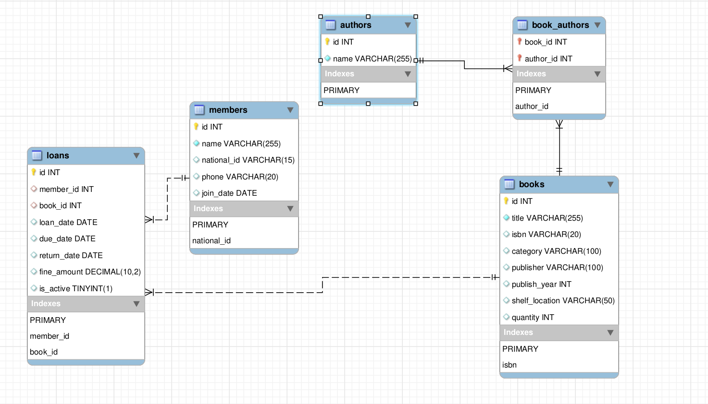

# Library Management System

## 1. Introduction
 This application allows library staff to manage book inventory, member registrations, and loan lifecycles through a command-line interface or a basic GUI.

## 2. Installation & Setup
### Prerequisites
- Ubuntu 24.04+
- Python 3.10+
- MySQL Server (use apt)

### Initial Setup
1.  **Install dependencies:**
    ```bash
    pip install -r requirements.txt
    ```
2.  **Configure Database:**
    - Create a `.env` file based on `.env.example`.
    - Initialize the schema:
      ```bash
      mysql -u [user] -p [database_name] < schema.sql
      ```

## 3. Using the CLI
Run the application:
```bash
python3 main.py
```

### Modules
- **Book Management:**
    - Add books with title, ISBN, category, and shelf location.
    - Multiple authors can be added (comma-separated).
    - Search by title (partial match) or ISBN.
- **Member Management:**
    - Register members with National ID and phone number.
    - Search members by name.
- **Loan Operations:**
    - **Issue Loan:** Requires Member ID and either Book ID or Book Title.
    - **Return Book:** Requires Loan ID. Automatically calculates fines if overdue.
- **Reports:**
    - Generate PDF reports for Inventory, Overdue Loans, Active Loans, and Member Directory.

There also is a basic help in the CLI menu.

## 4. Using the GUI
Run the application
```bash
python3 gui_main.py
```

## 5. Business Rules
- Loan Limit: Each member is strictly limited to one active loan at a time.
- Loan Period: The standard loan period is 7 days.
- Fines: Fines are calculated at a rate of $1.00 per day for overdue books.
- No Renewals: To extend a loan, the book must be returned and a new loan issued.

## 6. Database structure


## 7. Troubleshooting
Check `library_system.log` for detailed error traces if an operation fails unexpectedly.
